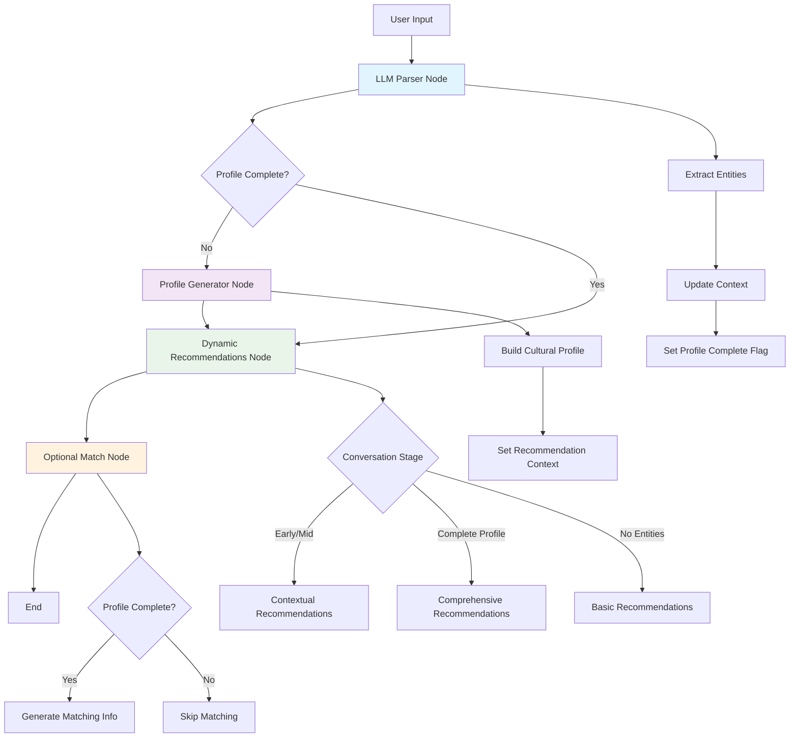
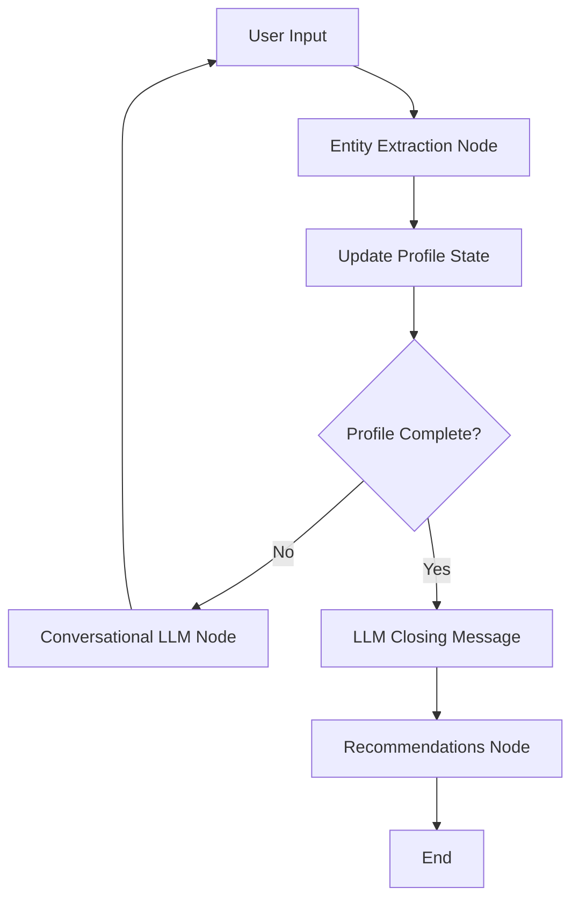

# TribuAI - Cultural Intelligence Engine

TribuAI is a cultural intelligence engine that provides personalized recommendations based on your cultural preferences. It combines the power of LangGraph for conversation flow management with real cultural data from Qloo API.

## Features

- **Dynamic Conversation Flow**: Uses LangGraph to manage multi-turn conversations
- **Entity Extraction**: Intelligently extracts cultural preferences from natural language
- **Contextual Recommendations**: Provides recommendations that adapt based on conversation progress
- **Real Cultural Data**: Uses Qloo API for authentic brand and place recommendations
- **Vue 3 Frontend**: Modern, responsive interface with real-time chat
- **Profile Completion**: Tracks profile completeness and generates comprehensive recommendations

## LangGraph Workflow

TribuAI uses a sophisticated LangGraph workflow to manage the conversation flow and generate contextual recommendations. The system processes user input through multiple specialized nodes:



### Node Descriptions

#### 1. **LLM Parser Node** (`llm_parser_node`)
- **Purpose**: Extracts structured cultural entities from natural language input
- **Input**: User's natural language message
- **Output**: Structured entities (music, art, fashion, values, places, audiences)
- **Key Features**:
  - Uses LLM to intelligently parse cultural references
  - Maps ambiguous inputs to closest categories (e.g., "horror movies" → "art")
  - Maintains conversation history for context
  - Updates profile completion status

#### 2. **Profile Generator Node** (`profile_generator_node`)
- **Purpose**: Creates a comprehensive cultural identity profile
- **Input**: Extracted entities and conversation context
- **Output**: Cultural profile with identity and description
- **Key Features**:
  - Builds contextual profile descriptions
  - Combines all cultural interests into narrative
  - Sets recommendation context for dynamic suggestions

#### 3. **Dynamic Recommendations Node** (`dynamic_recommendations_node`)
- **Purpose**: Generates adaptive recommendations based on conversation progress
- **Input**: Cultural profile, conversation history, completion status
- **Output**: Contextual brand and place recommendations
- **Key Features**:
  - **Early/Mid Conversation**: Shows contextual recommendations based on available entities
  - **Complete Profile**: Uses combined narrative for comprehensive recommendations
  - **No Entities**: Provides basic recommendations to guide conversation
  - Adapts strategy based on conversation stage and available information

#### 4. **Optional Match Node** (`optional_match_node`)
- **Purpose**: Generates matching information for complete profiles
- **Input**: Complete cultural profile with all entities
- **Output**: Matching information and cultural insights
- **Key Features**:
  - Only runs when profile is complete
  - Provides cultural matching insights
  - Skips gracefully for incomplete profiles

### State Management

The workflow uses a `TribuAIState` TypedDict to manage:

- **Input Data**: User input, session ID, timestamp
- **Processing Data**: Extracted entities, cultural profile, recommendations
- **Conversation State**: History, current context, recommendation context
- **Metadata**: Current node, processing time, error handling, profile completion status

### Flow Logic

1. **Entity Extraction**: LLM parses user input and extracts cultural entities
2. **Profile Building**: System builds cultural profile from extracted entities
3. **Dynamic Recommendations**: Recommendations adapt based on conversation progress:
   - **Incomplete Profile**: Contextual recommendations to guide conversation
   - **Complete Profile**: Comprehensive recommendations using combined narrative
4. **Optional Matching**: Cultural matching insights for complete profiles

## New Conversational Flow (v2)

TribuAI now uses a fully conversational, LLM-driven approach for cultural profile discovery:

- **Conversational LLM**: The LLM generates all questions and transitions dynamically, referencing the user's previous answers and the current state of their profile. There are no static or template-based questions.
- **Profile Completion**: The system tracks six required fields: music, art, fashion, values, places, and audiences. The LLM is instructed to elicit missing information in a natural, context-aware way.
- **Cierre Natural**: When all fields are complete, the LLM thanks the user and transitions to recommendations.
- **LangGraph State Management**: LangGraph manages the state, tracks which fields are filled, and determines when the profile is complete, but all conversational logic is handled by the LLM.

### Updated LangGraph Workflow



### Node Descriptions (v2)

#### 1. **Entity Extraction Node**
- **Purpose**: Extracts structured cultural entities from user input using the parser LLM.
- **Output**: Updates the profile state with new entities.

#### 2. **Conversational LLM Node**
- **Purpose**: Generates the next conversational, context-aware question to elicit missing profile fields.
- **Input**: Current profile state and conversation history.
- **Output**: A single, natural message to the user, referencing what is already known and asking for missing information.
- **Behavior**: No static templates; all questions are generated by the LLM.

#### 3. **LLM Closing Message**
- **Purpose**: When all six fields are complete, the LLM thanks the user and transitions to recommendations.

#### 4. **Recommendations Node**
- **Purpose**: Uses the completed profile to generate a combined narrative and fetch recommendations from Qloo.

### State Management

- **Profile Fields**: music, art, fashion, values, places, audiences (all required)
- **Conversation History**: Passed to the LLM for context
- **Profile Completion**: Determined by LangGraph, not by the LLM

### Example Flow

1. **User**: "I love techno music and street art."
2. **LLM**: "That's awesome! Your taste in techno and street art says a lot. How would you describe your personal style or fashion?"
3. **User**: "Vintage style."
4. **LLM**: "Vintage style is so expressive! Are there any places or cities that inspire you or feel like home?"
5. ...
6. **LLM (when all fields complete)**: "Amazing! I have a complete picture of your cultural identity. Let me find some recommendations you'll love."
7. **System**: Generates recommendations and displays them.

## Architecture

### Backend (FastAPI + LangGraph)

The backend uses LangGraph to orchestrate a sophisticated conversation flow:

- **LangGraph Workflow**: Manages conversation state and node transitions
- **Entity Extraction**: Uses LLM to parse cultural preferences from natural language
- **Dynamic Recommendations**: Adapts recommendations based on conversation progress
- **Qloo Integration**: Real cultural data for authentic recommendations

### Frontend (Vue 3 + Vite)

- **Real-time Chat**: Dynamic conversation interface
- **Cultural Input**: Specialized component for cultural preference input
- **Recommendations Display**: Shows brands and places with cultural context
- **Profile Tracking**: Visual indicators of profile completion

## Installation

### Backend Setup

```bash
cd backend
pip install -r requirements.txt
```

Set up environment variables:
```bash
cp env.example .env
# Edit .env with your API keys
```

### Frontend Setup

```bash
cd frontend
npm install
npm run dev
```

## API Endpoints

### Chat Endpoint

`POST /chat`

Processes user input through the LangGraph workflow and returns contextual responses.

**Request:**
```json
{
  "message": "I love horror movies and indie music",
  "session_id": "unique_session_id"
}
```

**Response:**
```json
{
  "assistant_message": "Great! I've learned about your interests. Now tell me about your art preferences.",
  "cultural_profile": {
    "identity": "Cultural Explorer",
    "description": "A cultural enthusiast who loves horror movies, indie music..."
  },
  "recommendations": {
    "brands": [...],
    "places": [...]
  },
  "profile_complete": false
}
```

## Key Features

### Dynamic Recommendations

The system provides three types of recommendations based on conversation progress:

1. **Basic Recommendations**: When no entities are extracted, provides general cultural suggestions
2. **Contextual Recommendations**: During conversation, shows recommendations based on available entities
3. **Comprehensive Recommendations**: For complete profiles, uses a combined narrative of all profile fields

### Profile Completion

The system tracks profile completeness across six key areas:
- Music preferences
- Art interests  
- Fashion choices
- Cultural values
- Favorite places
- Target audiences

When all areas are populated, the system generates comprehensive recommendations using a combined narrative approach.

### Entity Extraction

The LLM parser intelligently maps user input to cultural categories:

- **Direct Mapping**: "I love Taylor Swift" → music category
- **Ambiguous Mapping**: "horror movies" → art category (closest match)
- **Context Awareness**: Uses conversation history for better entity extraction

## Development

### Running the Backend

```bash
cd backend
uvicorn app.main:app --reload
```

### Running the Frontend

```bash
cd frontend
npm run dev
```

### Testing

```bash
# Backend tests
cd backend
python -m pytest

# Frontend tests
cd frontend
npm run test
```

## Contributing

1. Fork the repository
2. Create a feature branch
3. Make your changes
4. Add tests for new functionality
5. Submit a pull request

## License

MIT License - see LICENSE file for details.
